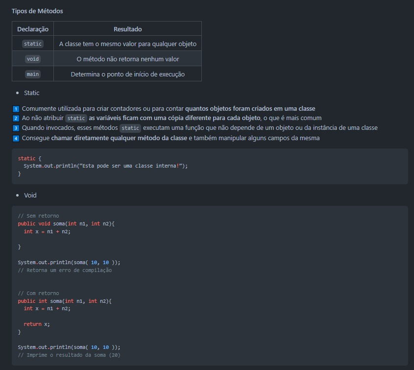
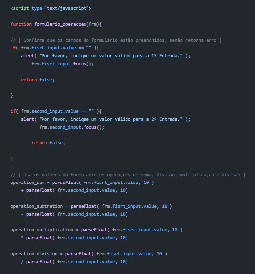
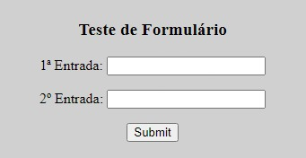

<h3 align="center"> 
  
</h3>

<h1 align="center">
   🔰 <a href="#"> ALGORITHM QUICKSTART </a>
</h1>

<h3 align="center">
    Guidance and templates for new programmers
</h3>


<p align="center">
  
  
  
  
  
  </a>
</p>

<h4 align="center"> 
	 Status: Ongoing
</h4>

---

Index
=================
<!--ts-->
   * [About](#about)
   * [Tools](#tools)
   * [References](#references)
      * [Git and GitHub](#git-and-github)
      * [Java](#java)
      * [JavaScript](#javascript)
      * [HTML](#html)
   * [Features](#features)
   * [Layout](#layout)
      * [Guidance](#guidance)
      * [Testers](#testers)
   * [Pre-requisites](#pre-requisites)
   * [Setup](#setup)
   * [Team](#team)

## About
Este projeto é um compilado de guias e códigos de teste criados para auxliar na introdução a novas linguagens de programação e ferramentas úteis para novos desenvolvedores. 

## Tools
Development of this template utilizes the tools listed below:

- [Visual Studio Code](https://code.visualstudio.com/docs)
- [IntelliJ IDEA](https://www.jetbrains.com/pt-br/idea/resources/)
- [Java SE Development Kit](https://www.oracle.com/java/technologies/downloads/)

## References
### Git and GitHub
- [Git Documentation](https://git-scm.com/doc)

### Java
- [Java SE Documentation](https://www.oracle.com/java/technologies/javase-documentation.html)

### JavaScript
- [JavaScript Guide](https://developer.mozilla.org/en-US/docs/Web/JavaScript/Guide)

### HTML
- [HTML Reference](https://developer.mozilla.org/en-US/docs/Web/HTML/Reference)

---

## Features

- [x] [Git and GitHub](./github)
- [x] [Java](./java)
- [x] [JavaScript](./javascript)
- [x] [HTML](./html)
- [ ] [Python]()
- [ ] [VBA]()

## Layout

### Guidance
<table class="tg">
<thead>

  <tr>
    <th class="tg-c3ow">Preview</th>
  </tr>
</thead>
<tbody>
  <tr>
    <td class="tg-c3ow"><br></td>
  </tr>
</tbody>
</table>

### Testers
<table class="tg">
<thead>

  <tr>
    <th class="tg-c3ow">Code</th>
    <th class="tg-c3ow">Preview</th>
  </tr>
</thead>
<tbody>
  <tr>
    <td class="tg-c3ow"><br></td>
    <td class="tg-c3ow"><br></td>
  </tr>
</tbody>
</table>

---

## Pre-requisites
Você pode usar uma IDE de navegador como o [Replit](https://replit.com/) ou a [Codeacademy](https://www.codecademy.com/), mas, para uma melhor experiência e aprendizado, considere fazer o [download](https://ninite.com/) de um editor avançado de código-fonte ([Visual Studio Code](https://code.visualstudio.com/download) ou [Eclipse](https://www.eclipse.org/downloads/)).

## Setup
```bash
# Clone esse repositório
$ git clone <https://github.com/vitoriape/algorithm-quickstart>

# Acesse a pasta do projeto
$ cd algorithm-quickstart

# Utilize a IDE ou o editor de sua preferência para testar

# Dica: utilize os guias introdutórios para cada linguagem/ferramenta
$ cd java
$ start guia.md
```

---

## Team
### Contributors
<table>
  <tr>
    <td align="center"><a href="https://github.com/vitoriape"><br /><sub><b>Vitória Peçanha</b></sub></a><br /><a href="https://www.linkedin.com/in/vitoria-pecanha/" title="LinkedIn">🌐</a>   <a href="mailto:vitoriapecanha.log@gmail.com" title="E-mail">📬</a>   <a href="https://translate.habitica.com/user/PenariaToji/" title="Linguists Commonwealth">📜</a></td>   
    <td align="center"><a href="https://github.com/VagnerGusmaoTI"><br /><sub><b>Wagner Gusmão</b></sub></a><br /><a href="https://www.linkedin.com/in/vagnergusmao" title="LinkedIn">🌐</a></td>
  </tr>
</table>

