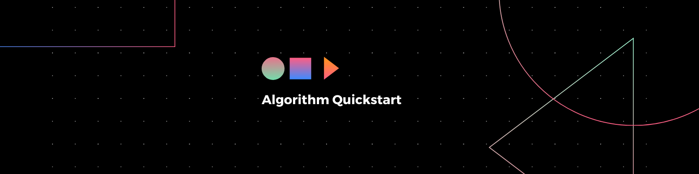

<h3 align="center"> 

</h3>

<p align="center">
  
  
  
  
  
  </a>
</p>

---

<p align="center">
 ◽ <a href="#-sobre">Sobre</a> |
 <a href="#-ferramentas">Ferramentas</a> |  
 <a href="#-instalação">Instalação</a> |
 <a href="#-autores">Autores</a> ◽
</p>

### 📌 Sobre

Este projeto é um compilado de guias e códigos de teste criados para auxliar na introdução a novas linguagens de programação e ferramentas úteis para novos desenvolvedores. 

### 📊 Recursos
As ferramentas/linguagens contempladas por este projeto são as seguintes:

- [x] [Git](https://git-scm.com/docs/git/en)
- [x] [Java](https://www.oracle.com/java/technologies/javase-documentation.html)
- [x] [JavaScript](https://developer.mozilla.org/pt-BR/docs/Web/JavaScript)
- [x] [HTML](https://developer.mozilla.org/pt-BR/docs/Web/HTML)
- [ ] [Python]()
- [ ] [VBA]()

### 🛠 Ferramentas

O desenvolvimento desse script utiliza as seguintes ferramentas:

- [Visual Studio Code](https://code.visualstudio.com/docs)
- [IntelliJ IDEA](https://www.jetbrains.com/pt-br/idea/resources/)
- [Java SE Development Kit](https://www.oracle.com/java/technologies/downloads/)

### 💻 Instalação
```bash
# Clone esse repositório
$ git clone <https://github.com/vitoriape/algorithm-quickstart>

# Acesse a pasta do projeto pelo terminal
$ cd algorithm-quickstart

# Utilize a IDE ou o editor de sua preferência para testar

# Dica: utilize os guias introdutórios para cada linguagem/ferramenta
$ cd java
$ start guia.md
```

---

### 💡 Autores

<table>
  <tr>
    <td align="center"><a href="https://github.com/vitoriape"><br /><sub><b>Vitória Peçanha</b></sub></a><br /><a href="https://www.linkedin.com/in/vitoria-pecanha/" title="LinkedIn">🌐</a>   <a href="mailto:vitoriapecanha.log@gmail.com" title="E-mail">📬</a>   <a href="https://translate.habitica.com/user/PenariaToji/" title="Linguists Commonwealth">📜</a></td>   
    <td align="center"><a href="https://github.com/VagnerGusmaoTI"><br /><sub><b>Wagner Gusmão</b></sub></a><br /><a href="https://www.linkedin.com/in/vagnergusmao" title="LinkedIn">🌐</a></td>
  </tr>
</table>
